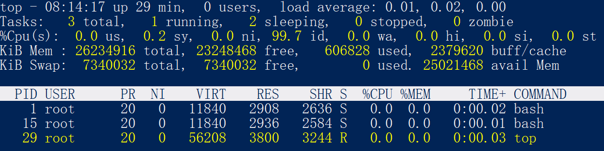

## Linux脚本考察
####一个文件里存了很多日志，每行IP开头，需要统计出排名前几的IP。
    awk '{print $1}' log.txt |sort |uniq -c|sort -nr -k 1|head -n 3

    awk '{print $1}' log
[awk命令详解](https://blog.csdn.net/jiaobuchong/article/details/83037467)

print $1 是获取log.txt文件的每行的第一个变量

    sort |uniq -c|sort -rn -k 1
[sort命令详解](https://www.runoob.com/linux/linux-comm-sort.html)  
[uniq命令详解](https://www.runoob.com/linux/linux-comm-uniq.html)

sort先排一次序 先排序是因为去重与统计的 ‘uniq’命令只能处理相邻行  
uniq 去重 -c 代表在每列旁边显示该行重复出现的次数   
sort -rn 表示依照数字大小顺序相反的顺序进行排序也就是逆序;-k 1表示使用第一列进行排序  

    head -n 3
表示取前3行显示

#### 如何查看某个端口被谁占用
        

## 概念考察
#### 用户态和内核态？

#### 进程、线程、协程

#### top命令
top命令请求方式
    [root@localhost ~]#top [选项]
    选项：
    -d 秒数：指定 top 命令每隔几秒更新。默认是 3 秒；
    -b：使用批处理模式输出。一般和"-n"选项合用，用于把 top 命令重定向到文件中；
    -n 次数：指定 top 命令执行的次数。一般和"-"选项合用；
    -p 进程PID：仅查看指定 ID 的进程；
    -s：使 top 命令在安全模式中运行，避免在交互模式中出现错误；
    -u 用户名：只监听某个用户的进程；
    
    在 top 命令的显示窗口中，还可以使用如下按键，进行一下交互操作：
    ? 或 h：显示交互模式的帮助；
    P：按照 CPU 的使用率排序，默认就是此选项；
    M：按照内存的使用率排序；
    N：按照 PID 排序；
    T：按照 CPU 的累积运算时间排序，也就是按照 TIME+ 项排序；
    k：按照 PID 给予某个进程一个信号。一般用于中止某个进程，信号 9 是强制中止的信号；
    r：按照 PID 给某个进程重设优先级（Nice）值；
    q：退出 top 命令；

top命令返回值

    
    top结果分为两部分，第一部分是前五行
    第一行 任务队列信息
        08:14:17 系统当前时间
        up 29 min 系统运行时间
        0 user 当前登录用户数
        load average：0.01，0.02,0.00 系统在之前 1 分钟、5 分钟、15 分钟的平均负载。如果 CPU 是单核的，则这个数值超过 1 就是高负载：如果 CPU 是四核的，则这个数值超过 4 就是高负载 （这个平均负载完全是依据个人经验来进行判断的，一般认为不应该超过服务器 CPU 的核数） 
    第二行 进程信息
        3 total 系统中的进程总数
        1 running 正在运行的进程数
        2 sleeping 睡眠的进程数
        0 stopped 正在停止的进程数
        0 zombie 僵尸进程数，如果不是0，需要人工检查该进程
    第三行 cpu信息
        0.0 us 用户模式占用的cpu百分比
        0.2 sy 系统模式占用的cpu百分比
        0.0 ni 改变过优先级的用户进程占用的CPU百分比
        99.7 id 空闲cpu占用百分比
        0.0 wa 等待输入/输出进程占用cpu百分比
        0.0 hi 硬中断请求服务占用cpu百分比
        0.0 si 软中断请求服务占用cpu百分比
        0.0 st st（steal time）意为虚拟时间百分比，就是当有虚拟机时，虚拟 CPU 等待实际 CPU 的时间百分比
    第四行 物理内存信息
        26234916 total 物理内存的总量，单位为KB
        23248468 free 己经使用的物理内存数量
        606828 used 空闲的物理内存数量。我们使用的是虚拟机，共分配了 628MB内存，所以只有53MB的空闲内存
        2379620 buff/cache 作为缓冲的内存数量
    第五行 交换分区
        7340032 total 交换分区（虚拟内存）的总大小
        7340032 free 已经使用的交换分区的大小
        0 used 空闲交换分区的大小
        25021468 avail Mem 作为缓存的交换分区的大小
    
    再来看 top 命令的第二部分输出，主要是系统进程信息，各个字段的含义如下：
        PID：进程的 ID。
        USER：该进程所属的用户。
        PR：优先级，数值越小优先级越高。
        NI：优先级，数值越小、优先级越高。
        VIRT：该进程使用的虚拟内存的大小，单位为 KB。
        RES：该进程使用的物理内存的大小，单位为 KB。
        SHR：共享内存大小，单位为 KB。
        S：进程状态。
        %CPU：该进程占用 CPU 的百分比。
        %MEM：该进程占用内存的百分比。
        TIME+：该进程共占用的 CPU 时间。
        COMMAND：进程的命令名。
    
#### 如何排查物理机下某个服务占用的内存和cpu？

